# Cognix

Minimal, professional AI study assistant platform combining a Flutter client
and a Django backend. Designed for clarity, quick setup, and straightforward
extension.

Project
- **Client:** Flutter mobile app (`cognix_flutter/`) — UI and file handling.
- **Backend:** Django API (`backend/`) — AI orchestration, document generation,
  and storage (SQLite by default).

Quick start
1. Backend: see [backend/README.md](backend/README.md) for setup and run steps.
2. Client: see [cognix_flutter/README.md](cognix_flutter/README.md) for Flutter setup and
	how to point the app at the backend.

## Screenshots

| | | | |
|:---:|:---:|:---:|:---:|
| 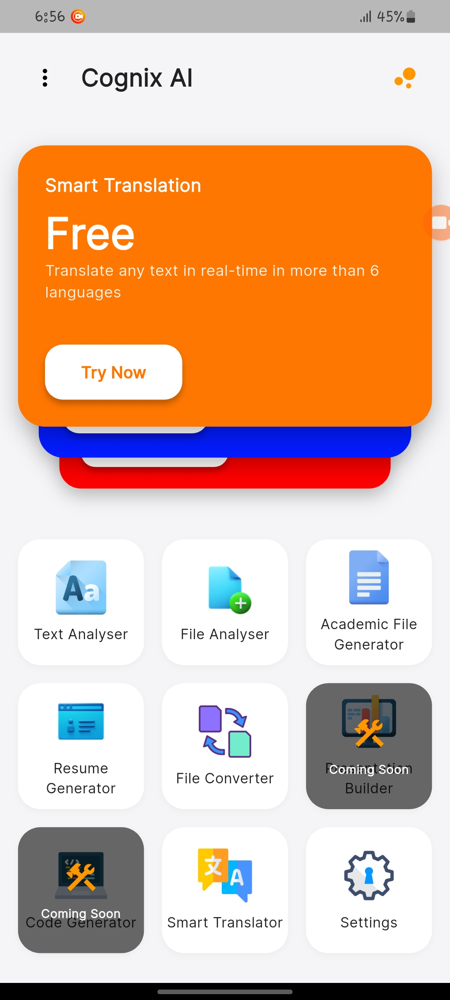 | 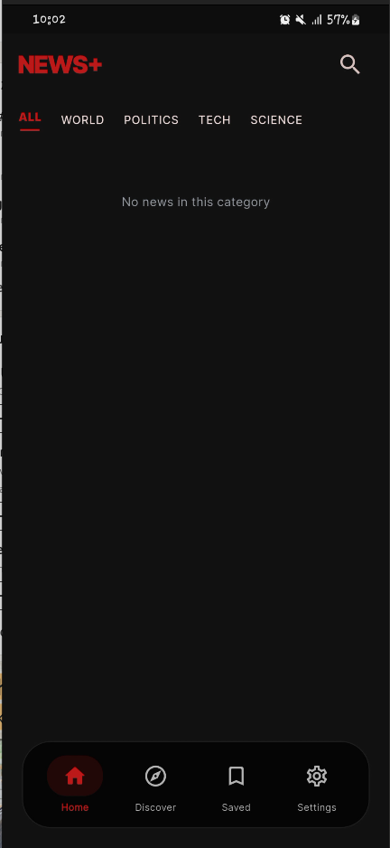 | 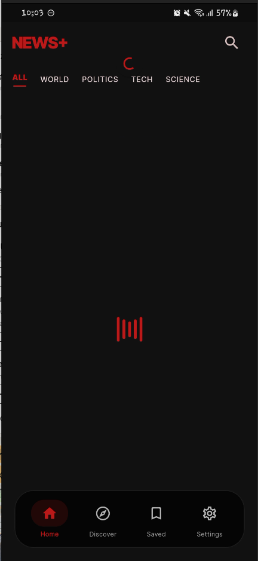 | 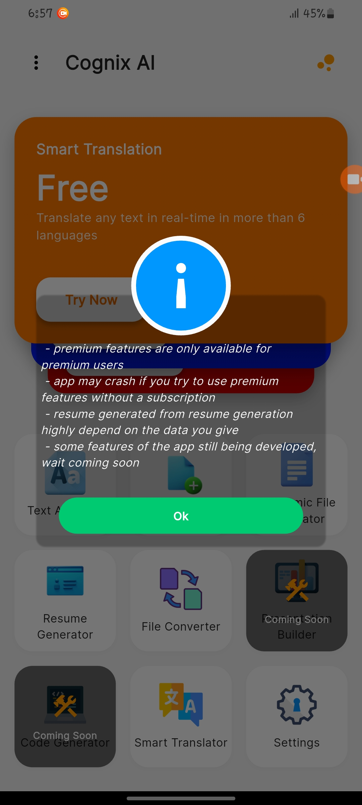 |
| 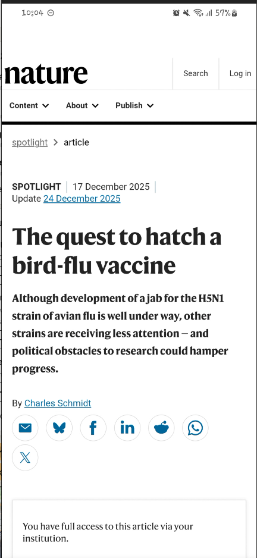 | 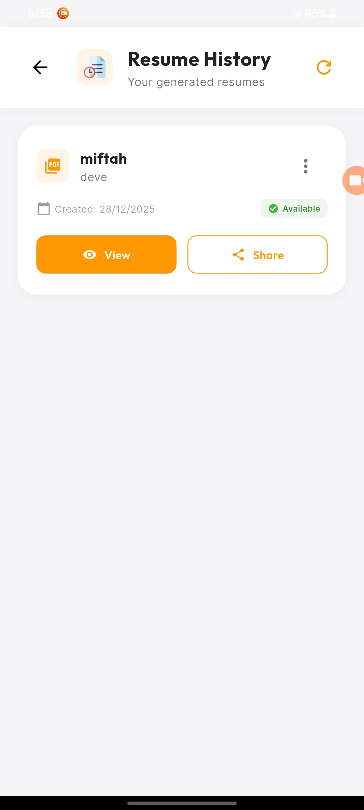 | 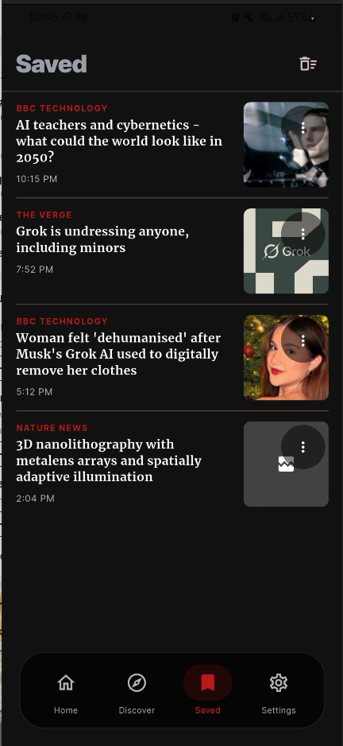 | 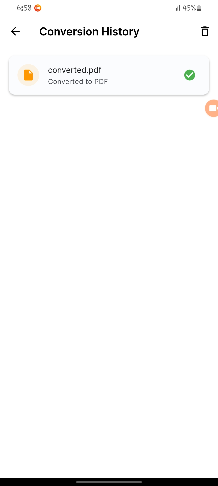 |
| 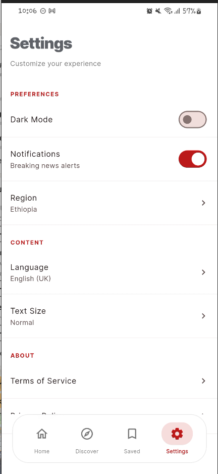 | 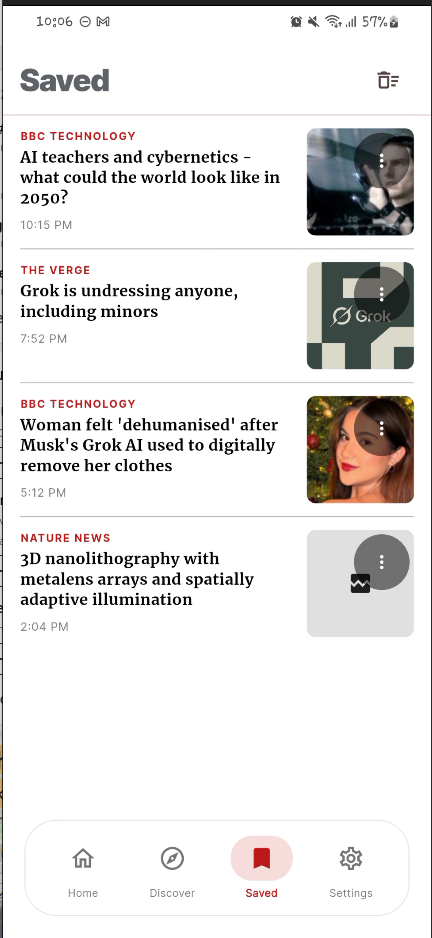 | 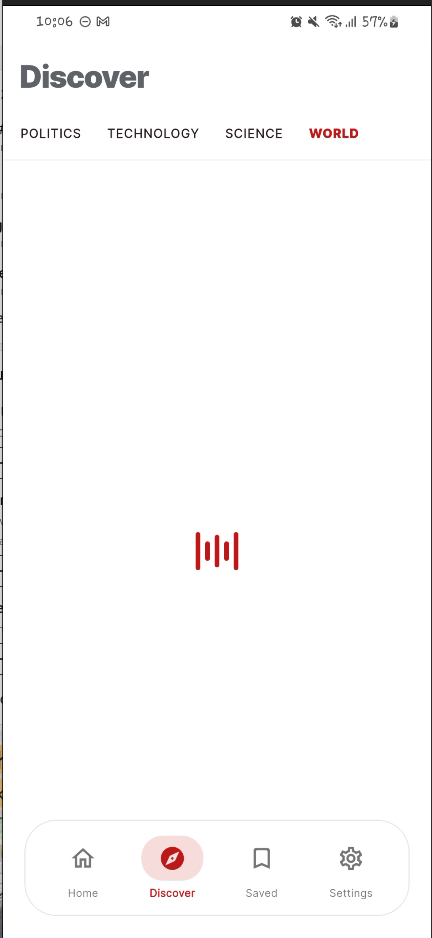 | 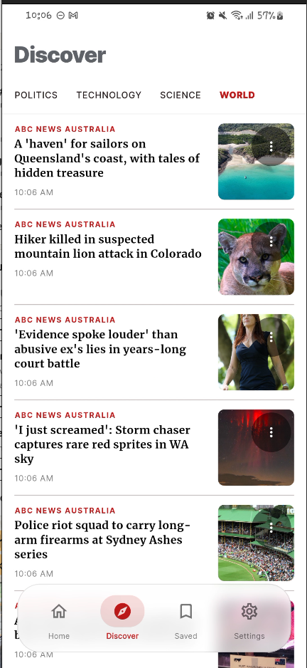 |
| 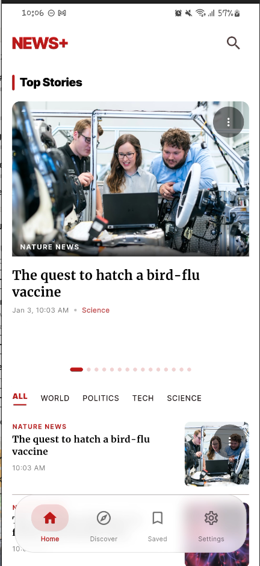 | 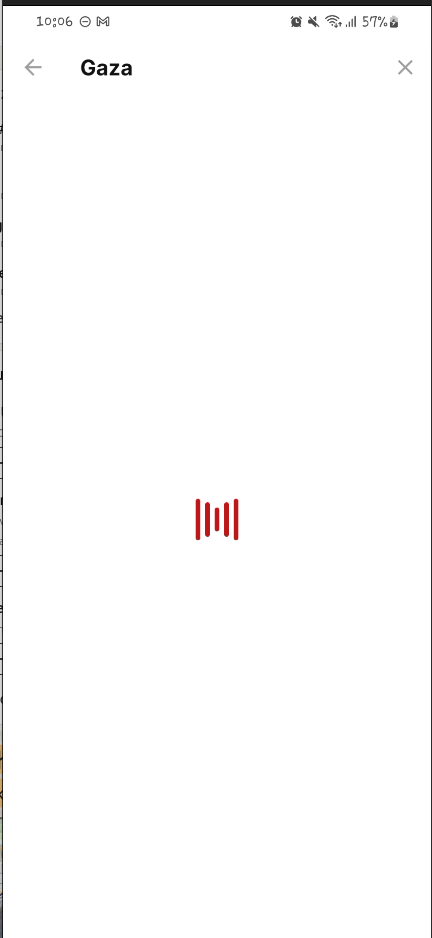 |  |  |

Contributing
- Open an issue or submit a pull request. Keep changes focused and well-tested.

License
This project is released under the MIT License — see [LICENSE](LICENSE).
